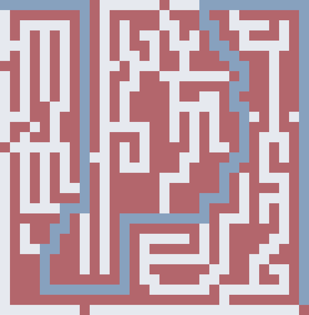
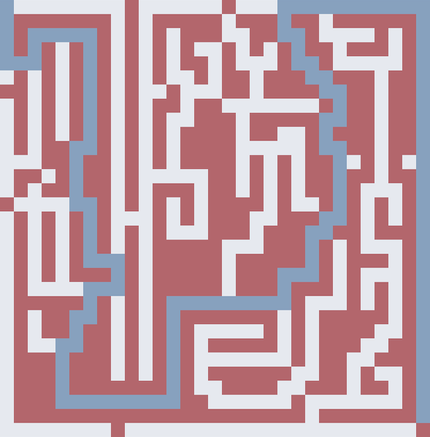

# amazeing

Amazeing is a maze generator/solver application with simulation/visualization.

## Installation

Clone the repository and build the project:

```sh
git clone https://github.com/eendroroy/amazeing.git
cd amazeing
cargo build --release
cargo install --path amazeing-app
```

## Usage

```txt
Usage: amazeing --path path/to/maze.txt --from usize,usize --to usize,usize <--bfs|--dfs|--dijkstra|--a-star> [--hue heuristic_name] [--ui-cli]

Options:
    -h, --help                 Print the help menu
        --path     str         Path to the maze file
        --from     usize,usize Start point
        --to       usize,usize End point
        --ui-cli               Run the simulation in cli mode instead of gui
        --bfs                  Run the simulation for BFS
        --dfs                  Run the simulation for DFS
        --dijkstra             Run the simulation for Dijkstra
        --a-star               Run the simulation for A*
        --heu      str         Heuristic function to use with A*
                               Choose from: manhattan, euclidean, chebyshev, octile, dijkstra
                               Default dijkstra if none provided
        --fps      u8          Gui FPS
```

## Sample

| BFS CLI                                                                               | DFS CLI                                                                               |
|---------------------------------------------------------------------------------------|---------------------------------------------------------------------------------------|
| `$ amazeing --path ./assets/maze/M2_R31_C31.txt --from 0,0 --to 29,30 --bfs --ui-cli` | `$ amazeing --path ./assets/maze/M2_R31_C31.txt --from 0,0 --to 29,30 --bfs --ui-cli` |
|                                              |                                              |

## License

This project is licensed under the [GNU AGPL-3.0 License](https://www.gnu.org/licenses/agpl-3.0.html). See
the [LICENSE](./LICENSE) file for more details.
