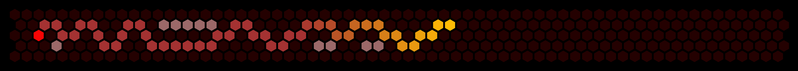

# amazeing

Amazeing is a maze generator/solver application with simulation/visualization.



## Installation

Clone the repository and build the project:

```sh
git clone https://github.com/eendroroy/amazeing.git
cd amazeing
cargo install --path amazeing
```

## Usage

>Run `amazeing --help`

### Key/Mouse events

- (`LeftControl`/`RightControl`)+`I` - Save current screen as png in current directory
- Create
    - `G`/`<Space>` - (Re)Generate Maze
    - Additional action in simulation mode (`--verbose`/`-v`):
        - `LeftClick` - Add Source
        - `Shift`+`LeftClick` - Remove Source
        - `S`/`<Space>` - Start Simulation
        - `<Space>` - Start/Pause/Resume Simulation

- View - Update mode (`--update`/`-u`):
    - `LeftClick` - Open path
    - `Shift`+`LeftClick` - Block Path
    - (`LeftControl`/`RightControl`)+`S` - Save current maze to same file

- Solve
    - `LeftClick` - Select Source
    - `Shift`+`LeftClick` - Select Destination
    - Additional action in simulation mode (`--verbose`/`-v`):
        - `S`/`<Space>` - Start Simulation
        - `<Space>` - Start/Pause/Resume Simulation

## Example Commands

#### Generate - single source

```shell
# generate 21x21 maze using BFS - single source
amazeing create --maze bfs_21_21.maze --rows 21 --cols 21 --source 10,10 --procedure bfs --shape square
# short
amazeing C -m bfs_21_21.maze -r 21 -c 21 -s 10,10 -p bfs -U square

# simulate - multi source
amazeing create --rows 21 --cols 21 --source 10,10 --procedure bfs --verbose --fps 25 --shape hexagonal
# short
amazeing C -r 21 -c 21 -s 10,10 -p bfs -v -F 25 -U hexagonal
```

#### Generate - multi source

```shell
# generate 21x21 maze using BFS - multi source
amazeing create --maze bfs_21_21.maze --rows 21 --cols 21 --source 7,7 --source 14,14 --procedure bfs --shape sqaure
# short
amazeing C -m bfs_21_21.maze -r 21 -c 21 -s 7,7 -s 14,14 -p bfs -U square

# simulate - multi source
amazeing create --rows 21 --cols 21 --source 7,7 --source 14,14 --procedure bfs --verbose --fps 25 --shape hexagonal
# short
amazeing C -r 21 -c 21 -s 7,7 -s 14,14 -p bfs -v -F 25 -U hexagonal
```

#### Update

```shell
# update bfs_21_21.maze
amazeing view --maze bfs_21_21.maze --update
# short
amazeing V -m bfs_21_21.maze -u
```

#### Solve

```shell
# solve bfs_21_21.maze
amazeing solve --maze bfs_21_21.maze --procedure bfs --shape hexagonal
# short
amazeing S -m bfs_21_21.maze -p bfs -U hexagonal

# simulate
amazeing solve --maze bfs_21_21.maze --procedure bfs --verbose --fps 25 --unit-share square
# short
amazeing S -m bfs_21_21.maze -p bfs -v -F 25 -U square
```

## Generate Maze

| Algorithm          | Shape     |                                                                                                            |
|--------------------|-----------|------------------------------------------------------------------------------------------------------------|
| Dfs                | Hexagonal | [](https://www.youtube.com/watch?v=twafvSeVQOs) |
| Dfs (Multi Source) | Square    | [](https://www.youtube.com/watch?v=fL93bHyf6-M) |
| Dfs                | Square    | [](https://www.youtube.com/watch?v=iyxUARc2T2g) |
| Bfs                | Square    | [](https://www.youtube.com/watch?v=st8RLTgAuuE) |

## Solve Maze

| Algorithm      | Shape   |                                                                                                            |
|----------------|---------|------------------------------------------------------------------------------------------------------------|
| A* (Octile)    | Hexagon | [](https://www.youtube.com/watch?v=MRt7X6JGDuo) |
| DFS            | Square  | [](https://www.youtube.com/shorts/9F8XRL7lnIU)  |
| BFS            | Square  | [](https://www.youtube.com/shorts/h8q5vi68fz0)  |
| A* (Manhattan) | Square  | [](https://www.youtube.com/watch?v=LkxyikxTX6Y) |

## Add-on

[Color scheme generator](contrib/scheme-generator.html)

<iframe src="contrib/scheme-generator.html" width="100%" height="890px"></iframe>

## License

This project is licensed under the [GNU AGPL-3.0 License](https://www.gnu.org/licenses/agpl-3.0.html). See
the [LICENSE](./LICENSE) file for more details.
